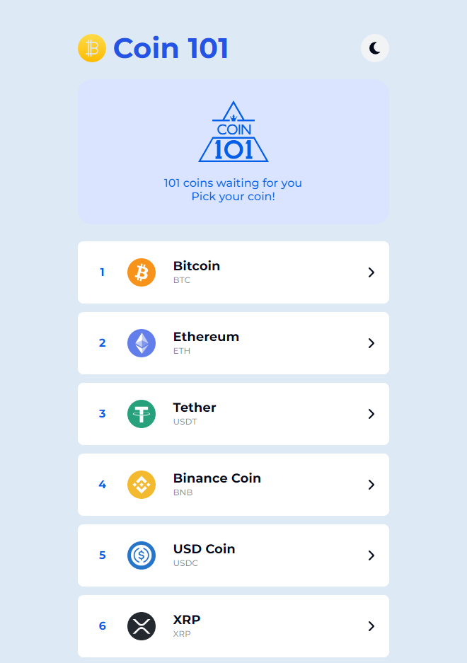

# 💰 Coin101

- [DEMO 바로가기](https://rigood.github.io/coin101/)

|                            메인                             |                                차트                                |                                가격                                |
| :---------------------------------------------------------: | :----------------------------------------------------------------: | :----------------------------------------------------------------: |
|  |  |  |

## 1. 프로젝트 소개

`Coinpaprika API`를 이용하여 시가총액 상위 101개 코인 순위와 해당 코인에 대한 차트, 가격 정보를 제공합니다.

- 2023-07-11 리팩토링
- 2022-09-09 개발

## 2. 기술 스택

- React
- TypeScript
- React-query
- Apexcharts
- React-router-dom
- Recoil
- Styled-components
- React-tooltip
