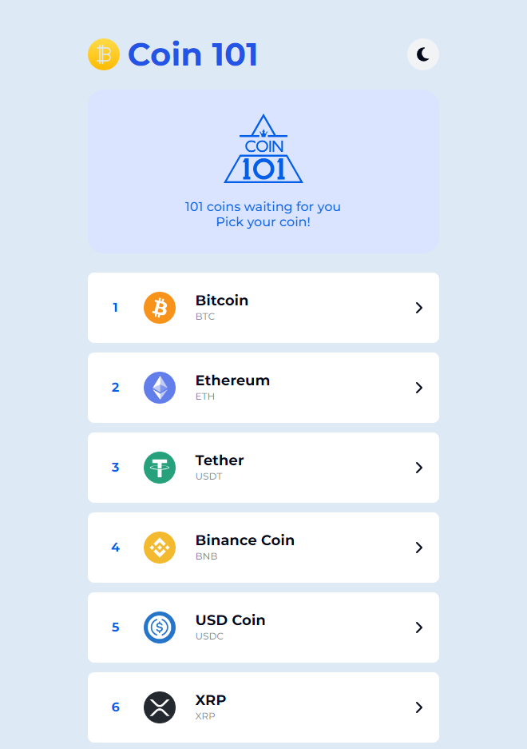
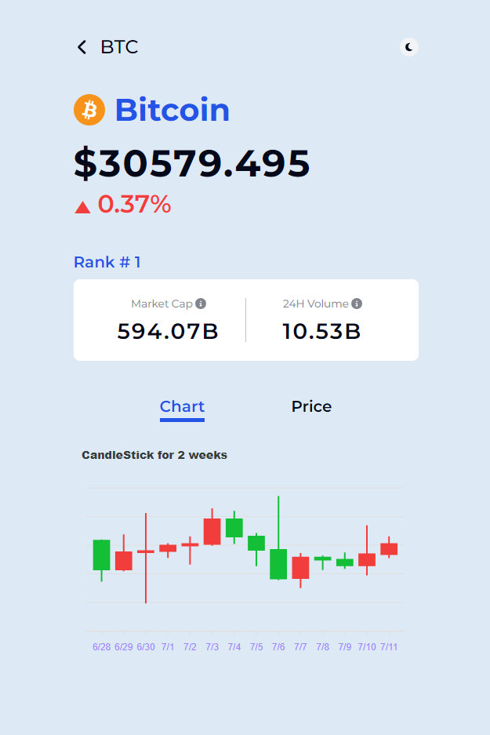
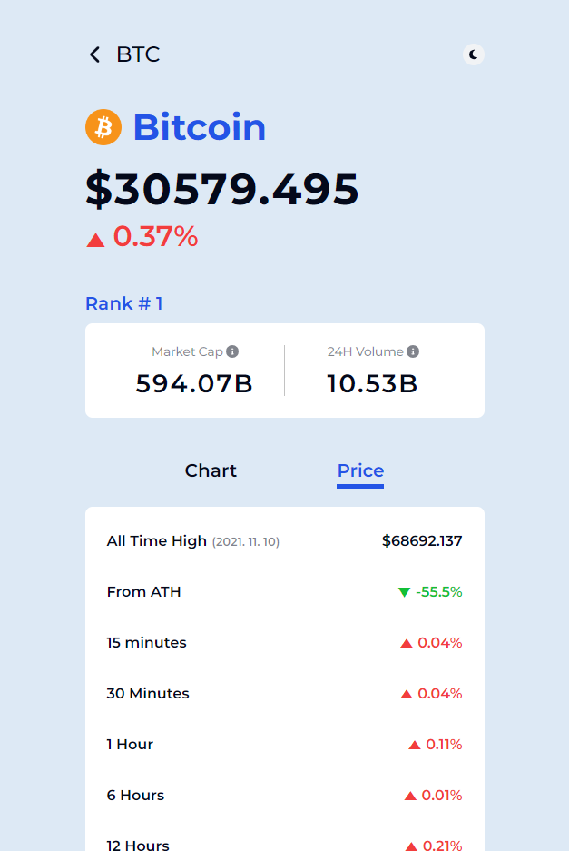
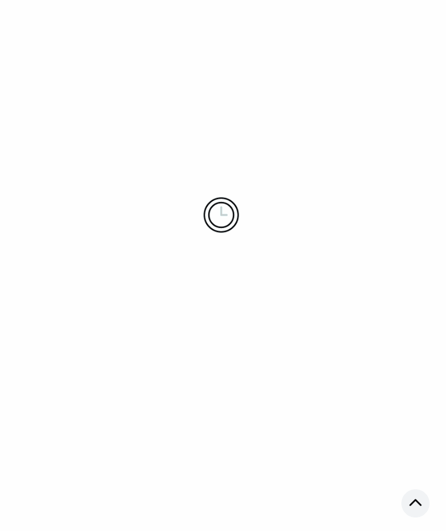

# 💰 Coin101

- https://rigood.github.io/coin101
- `Coinpaprika API`를 이용하여 상위 `101개 코인 순위`와 해당 코인에 대한 `차트, 가격 정보`를 제공합니다.

<br>

|                     메인                      |                         차트                         |                         가격                         |
| :-------------------------------------------: | :--------------------------------------------------: | :--------------------------------------------------: |
|  |  |  |

<br>

## 1. 프로젝트 소개

- `react-query` 사용법을 익히고, `apexcharts`를 통해 데이터 시각화를 연습하기 위한 프로젝트입니다.

#### 개발 일정

- 2022.09.06~2022.09.09 개발
- 2023.07.11~2023.07.12 리팩토링

<br>

## 2. 주요 기능



- **API 요청**을 통해 상위 101개 코인 목록을 가져옵니다.
- 최초에는 **로딩 이미지**가 표시되며, 그 이후에는 **데이터가 캐싱**됩니다.
- CSS animation으로 상단 **배너 슬라이드**(앱 로고+유튜브 링크)를 구현하였습니다.
- 페이지 우측 하단에 스크롤 맨 위로 이동할 수 있는 **TOP 버튼**을 배치하였습니다.
- **styled-components, recoil**를 이용하여 **다크모드**를 구현하였으며, 부드럽게 전환되도록 transition을 적용하였습니다.
  - recoil을 통해 다크모드 상태값(isDark atom)을 전역 관리하고,
  - styled-components의 ThemeProvider에 다크모드 상태값에 따라 theme 적용

<br>


- URL에서 coinID를 추출하여, **API 요청**을 통해 코인 상세정보를 가져옵니다.
- 최초에는 **로딩 이미지**가 표시되며, 그 이후에는 **데이터가 캐싱**됩니다.
- **react-query의 select 옵션**을 사용하여 최근 2주간의 가격 정보를 선택하고, **apexcharts**를 이용하여 **Candlestick**을 구현하였습니다.
- Candlestick 정보가 없는 경우, **에러 문구를 표시**하였습니다.
- Price 탭에서는 상세 가격정보를 확인할 수 있으며, 상승/하락 여부에 따라 색상을 적용하였습니다.
- **react-tooltip**을 사용하여, 용어 설명을 나타내었습니다.

<br>

## 3. 기술 스택

- React
- TypeScript
- React-query
- Apexcharts
- React-router-dom
- Recoil
- Styled-components
- React-tooltip

<br>

## 4. 폴더 구조

```
📦 root
├─ 📦 public
│  ├─ 📂 assets
│  └─ 📜 index.html
└─ 📦 src
   ├─ 📂 assets
   │  └─ 📂 images
   ├─ 📂 components
   │  └─ 📂 Buttons
   │  └─ 📂 CardSlide
   │  └─ 📂 Chart
   │  └─ 📂 Layout
   │  └─ 📂 Loader
   │  └─ 📂 Price
   ├─ 📂 pages
   │  ├─ 📜 Coin.tsx
   │  ├─ 📜 Coins.tsx
   ├─ 📂 styles
   │  ├─ 📜 GlobalStyle.tsx
   │  ├─ 📜 theme.ts
   ├─ 📂 types
   ├─ 📂 utils
   ├─ 📜 App.tsx
   └─ 📜 index.tsx
   └─ 📜 Router.tsx
   └─ 📜 api.ts // react-query에서 사용할 queryFn 모음
   └─ 📜 atoms.ts // recoil 상태값 모음
   └─ 📜 utils.ts
```
